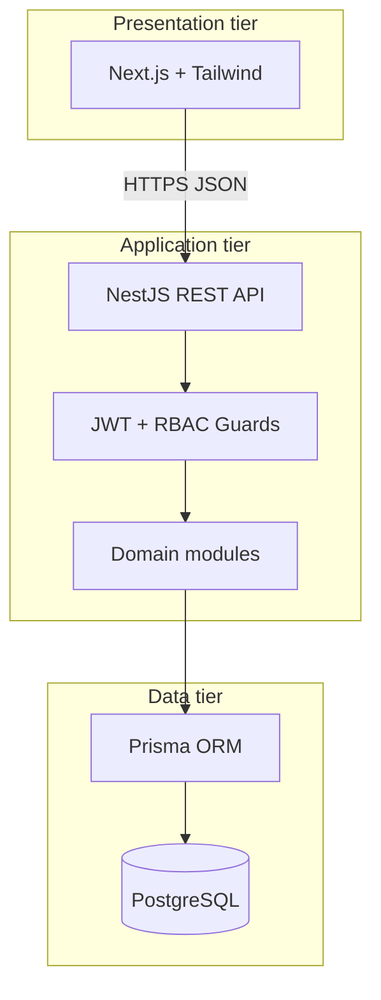
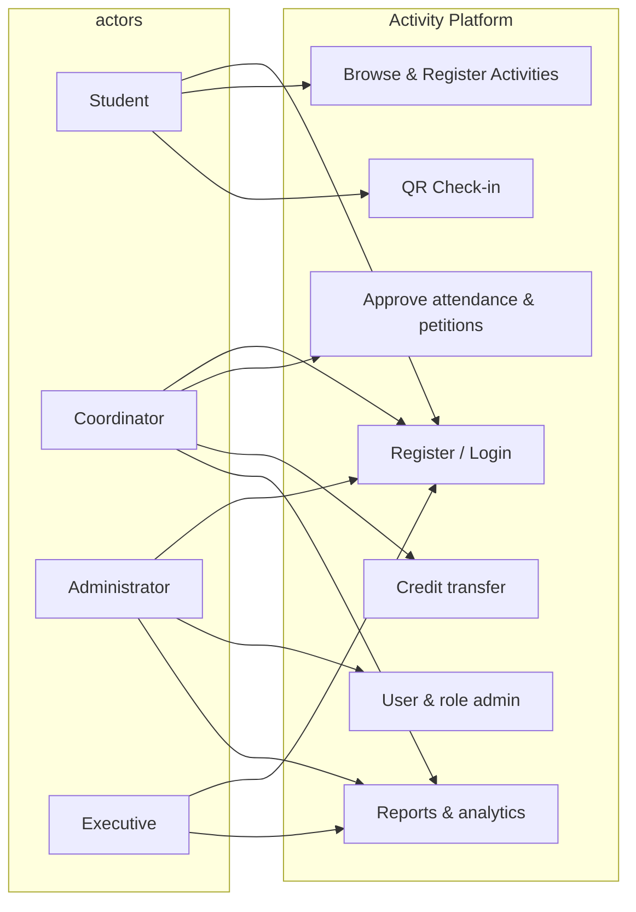
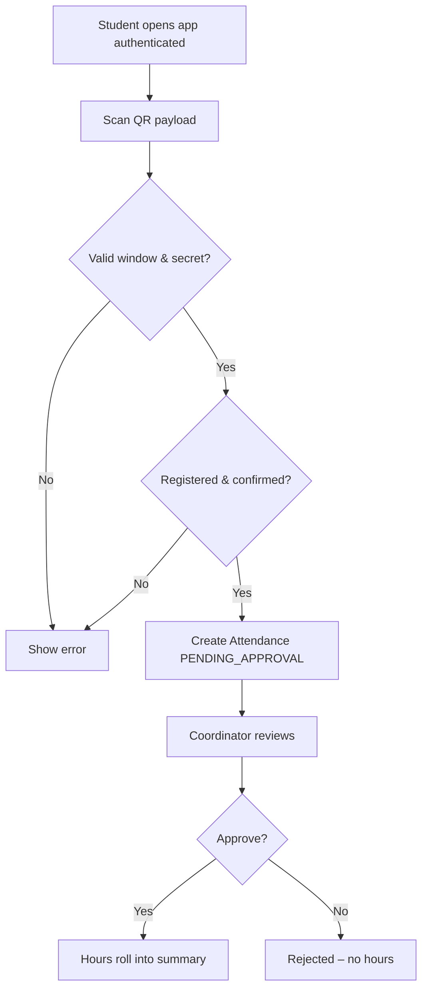
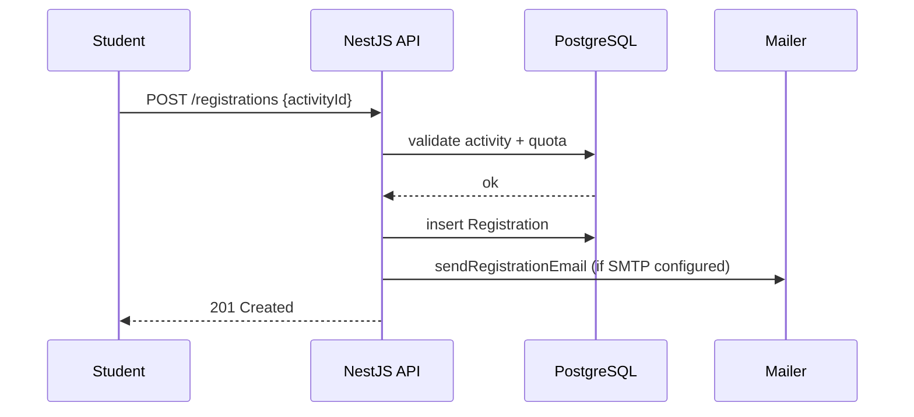
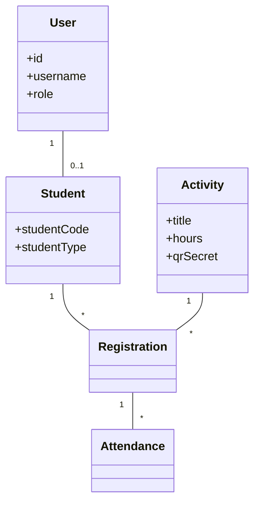
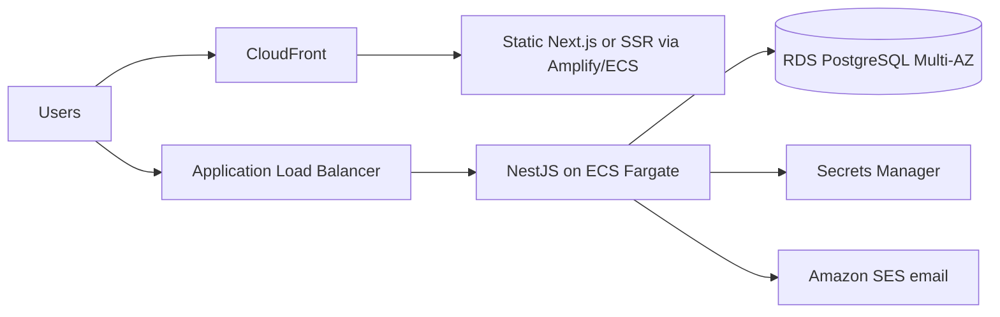

# Chapter 4 – System Design and Development  
# Chapter 5 – Results, Discussion, and Recommendations (template)  
# Annex: Enterprise architecture, security, APIs, and testing

This document aligns with **Chapters 1–3** of *การพัฒนาเว็บแอปพลิเคชันเพื่อการลงทะเบียนและตรวจสอบผลการเข้าร่วมกิจกรรมนักศึกษา กรณีศึกษามหาวิทยาลัยราชภัฏสุรินทร์* and the implemented codebase under `apps/api` and `apps/web`.

---

## A. Summary of requirements extracted from Chapters 1–3

### A.1 Functional requirements (from scope §1.3 and methodology §3.3)

- **User & access**: Registration, login, RBAC by role; students maintain profile; staff manage activities and approvals; admins manage users and master data.
- **Activity lifecycle**: Create/edit activities; classify by **5 domains**, **university/faculty level**, **core vs elective** nature; support **make-up** activities; quotas; publish/cancel states.
- **Registration & attendance**: Students register; **QR-based check-in** within the activity time window; optional proof image path; attendance pending coordinator approval before hours count.
- **Hours & graduation rules**: Differentiate **regular** (≥25 activities, ≥100 hours) vs **special track** (≥4 activities, ≥50 hours); display progress toward targets.
- **Credit transfer**: Record leadership / university-representative hour grants with audit trail (approver, title, category, hours).
- **Corrections & special claims**: Amendment requests on registrations; “special hour” petitions with evidence for off-system beneficial activities.
- **Certificates**: Issue participation certificate when **both** hour and activity-count thresholds are met (system gate before PDF).
- **Reporting & oversight**: Executive/coordinator dashboards; export rosters (**Excel**); notification log for email dispatch.

### A.2 Non-functional requirements

- **Usability**: Responsive UI (mobile + desktop); clear success/error feedback (aligned with questionnaire items in Appendix).
- **Security & privacy**: Authenticated APIs; password hashing; least-privilege RBAC; audit-friendly logs; readiness for **PDPA** (Thailand) and **GDPR**-style practices for EU collaborations (data minimization, retention, export/erasure processes).
- **Reliability & maintainability**: Modular NestJS domains; Prisma migrations; containerized deployment.
- **Performance & scale**: Stateless API behind load balancer; DB indexing on foreign keys; rate limiting (Nest Throttler).
- **Interoperability**: OpenAPI (Swagger) at `/api/docs` for integration with campus IdP or future mobile apps.

---

## B. Stakeholders

| Stakeholder | Interest |
|-------------|----------|
| **Students** | Discover activities, register, check in, track hours, request corrections/special hours, download certificates. |
| **Activity coordinators** (กองพัฒนานักศึกษา / faculty staff) | Create activities, rotate QR secrets, approve attendance & petitions, export rosters, record credit transfers. |
| **System administrators** | User provisioning, role assignment, configuration, backup/restore procedures, audit review. |
| **Executives / quality assurance** | Read-only analytics, compliance reporting, strategic oversight of participation rates. |

---

## C. System architecture

**Pattern**: **Three-tier**, **API-first**, **container-ready** (evolvable to microservices by splitting bounded contexts: *Identity*, *Activities*, *Attendance*, *Reporting*).



**Rationale**: Clear separation for security reviews, horizontal scaling of the API tier, and independent UI iteration.

---

## D. Database schema (summary)

Implemented in `apps/api/prisma/schema.prisma` (extends the six core tables from your thesis with audit/notification support):

| Table | Purpose |
|-------|---------|
| `User` | Credentials, role, optional email, soft delete. |
| `Student` | Profile, faculty/major, year, **student type** (regular/special). |
| `Activity` | Metadata, schedule, category/nature/level, **qrSecret** (server-only; stripped from public JSON). |
| `Registration` | Student–activity enrollment + status. |
| `Attendance` | Check-in row, proof path, approval workflow. |
| `CreditTransfer` | Granted hours with approver reference. |
| `AmendmentRequest` | Correction workflow. |
| `SpecialHourRequest` | External-benefit petitions. |
| `AuditLog` | Security/operations events (extend usage in production). |
| `NotificationLog` | Email attempts for PDPA accountability. |

---

## E. UML (Mermaid)

### E.1 Use case diagram



### E.2 Activity diagram (check-in)



### E.3 Sequence diagram (registration + email)



### E.4 Class diagram (domain sketch)



---

## F. RBAC matrix

| Capability | STUDENT | COORDINATOR | ADMIN | EXECUTIVE |
|------------|---------|--------------|-------|-----------|
| Register/login | ✓ | ✓ | ✓ | ✓ |
| Manage own profile | ✓ | — | — | — |
| Create/edit activities | — | ✓ | ✓ | — |
| Rotate QR / roster export | — | ✓ | ✓ | read-only exports where enabled |
| Approve attendance & petitions | — | ✓ | ✓ | — |
| Credit transfer | — | ✓ | ✓ | — |
| User provisioning | — | — | ✓ | — |
| Dashboard metrics | — | ✓ | ✓ | ✓ |

Guards: `JwtAuthGuard` + `RolesGuard` + `@Roles(...)`.

---

## G. Security standards (JWT, OAuth2-ready, encryption, PDPA/GDPR)

- **Authentication**: **JWT** access tokens (short-lived, e.g. 8h) with `Authorization: Bearer`. For campus-wide SSO, add **OAuth2/OIDC** (Azure AD / Keycloak / Google Workspace) as an additional `AuthModule` strategy while preserving RBAC claims in the token or via user lookup.
- **Password storage**: **bcrypt** (cost factor 12 in seed paths; tune per ops policy).
- **Transport**: **TLS 1.2+** everywhere (reverse proxy: Nginx, AWS ALB, Cloudflare).
- **Encryption at rest**: PostgreSQL volume encryption (cloud-managed disks), optional column-level encryption for highly sensitive attributes.
- **PDPA / GDPR alignment (operational)**:
  - **Lawful basis & notice**: privacy notice on registration; purpose limitation (activities only).
  - **Data minimization**: avoid collecting unnecessary PII; optional email.
  - **Access & rectification**: amendment flows; admin-assisted correction.
  - **Retention**: define retention for logs, proofs, and graduated students (implement scheduled jobs).
  - **Breach procedure & DPA**: document subprocessors (email provider, cloud host).

---

## H. Technology stack

| Layer | Choice | Notes |
|-------|--------|-------|
| Frontend | **Next.js 15**, **Tailwind CSS** | App Router, standalone Docker output. |
| Backend | **NestJS 10**, **Prisma 5**, **PostgreSQL 16** | Validation (`class-validator`), OpenAPI. |
| AuthZ | **JWT + RBAC** | OAuth2/OIDC can wrap the same user store. |
| Messaging | **Nodemailer** + `NotificationLog` | Wire real SMTP in production. |
| Exports | **ExcelJS**, **PDFKit** | Roster XLSX, certificate PDF. |
| DevOps | **Docker Compose** | Maps to **AWS ECS/Fargate + RDS**, **GCP Cloud Run + Cloud SQL**, or **Azure App Service + Azure Database for PostgreSQL**. |

---

## I. RESTful API examples (implemented)

Base URL: `/api` (global prefix). Swagger: `/api/docs`.

### I.1 Login

**Request**

```http
POST /api/auth/login
Content-Type: application/json

{"username":"64100001","password":"Student123!"}
```

**Response**

```json
{
  "accessToken": "<jwt>",
  "tokenType": "Bearer",
  "expiresIn": "8h",
  "user": { "id": "...", "username": "64100001", "role": "STUDENT" }
}
```

### I.2 Register for activity

```http
POST /api/registrations
Authorization: Bearer <jwt>
Content-Type: application/json

{"activityId":"<uuid>"}
```

### I.3 QR check-in

```http
POST /api/attendances/check-in
Authorization: Bearer <jwt>
Content-Type: application/json

{"activityId":"<uuid>","qrSecret":"<server-rotated-secret>"}
```

### I.4 Approve attendance

```http
PATCH /api/attendances/<id>/review
Authorization: Bearer <staff-jwt>
Content-Type: application/json

{"status":"APPROVED"}
```

### I.5 Excel roster

`GET /api/reports/activity/:activityId/roster.xlsx` (staff JWT).

---

## J. UI/UX wireframe descriptions (major pages)

1. **Landing**: Hero, value proposition, CTAs to register/login/activities list; university branding region.
2. **Login / Register**: Card forms, inline validation, links between flows; password strength hint.
3. **Activity catalog**: Responsive cards, filters (category/level future), empty state.
4. **Activity detail**: Description, schedule, CTA register, link to QR check-in helper.
5. **Student dashboard**: Hour donut/progress vs target, activity count, eligibility flag, certificate download.
6. **QR check-in**: Camera-based flow (extend with `html5-qrcode`); current MVP accepts JSON from coordinator endpoint for field testing.
7. **Coordinator console** (extend front-end): tables for pending attendances, petitions, rotate QR, export.
8. **Admin**: user table, role assignment, audit filters.

---

## K. Deployment architecture (example: AWS)



**Hardening**: WAF on ALB, VPC private subnets for RDS, automated backups, CloudWatch alarms on 5xx and DB CPU.

---

## L. Scalability, maintainability, performance

- **Scale out**: Stateless API replicas; sticky sessions not required for JWT.
- **DB**: Indexes on `Registration(activityId)`, `Attendance(registrationId)`, status fields; consider read replica for heavy reporting.
- **Caching**: Redis for session blacklist (if refresh tokens added) and hot activity catalogs.
- **Async jobs**: Move email/PDF bulk generation to a queue (BullMQ + Redis) at high volume.
- **Maintainability**: Module boundaries in NestJS mirror DDD contexts; Prisma migrations version schema.

---

## M. Testing strategy

| Level | Scope | Tools |
|-------|-------|-------|
| **Unit** | Hour aggregation, QR validation window, RBAC guard logic | Jest |
| **Integration** | Prisma + controllers with Testcontainers PostgreSQL | Jest + supertest |
| **UAT** | Scenario scripts matching thesis questionnaires (Likert items) | Scripted walkthroughs + Google Forms correlation |

---

## N. Chapter 4 – Narrative for thesis (paste-ready outline)

1. **Introduction to system design** — map objectives from Chapter 1 to software functions.  
2. **Overall architecture** — three-tier diagram, technology choices, deviation from PHP/Laravel prototype (justify maintainability and hiring market).  
3. **Database design** — ER narrative, normalization, mapping to Prisma schema.  
4. **Application design** — module list, RBAC, major workflows (registration, QR, approval, certificate).  
5. **Interface design** — wireframes, responsive principles, accessibility considerations.  
6. **Security & privacy design** — JWT, TLS, PDPA measures, audit logging strategy.  
7. **Implementation** — repository structure, build/run, Docker, Swagger.  
8. **Deployment plan** — environments (dev/stage/prod), backup, monitoring.

---

## O. Chapter 5 – Results, discussion, recommendations (template)

> Fill with your empirical results (expert n=5, student sample via Yamane, mean / S.D., Likert interpretation per §3.4–3.6).

1. **System trial results** — functional checklist vs. requirements.  
2. **Expert evaluation** — table of means per dimension (accuracy, usability, security).  
3. **Student satisfaction** — UI/process/benefits factors.  
4. **Discussion** — compare with related works [1]–[6] from your bibliography; explain QR efficiency hypothesis vs. your measurements.  
5. **Limitations** — e.g., dependency on mobile coverage, coordinator workload, integration with registrar system.  
6. **Recommendations** — SSO, native mobile scanner, automated backup dashboards, analytics for faculty-level KPIs.

---

## P. OAuth2 positioning (for future work paragraph)

The current system uses **JWT bearer tokens** suitable for SPA + API. A university production rollout should add **OAuth2 Authorization Code + PKCE** against the campus IdP, map groups to `Role`, and optionally issue **short-lived access tokens** with **refresh tokens** stored httpOnly. This aligns with international practice without locking the thesis prototype to a single vendor.
